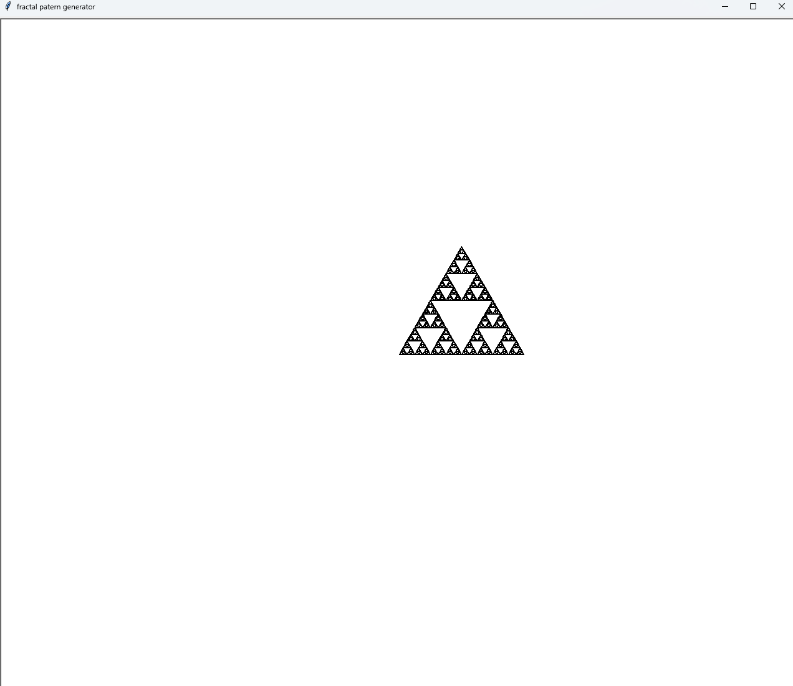

# Fractal Patern Genrator
***

this project makes a sierpinski tryangle of any color on any backround you want, any depth, and any backround color

## usage
***
1. make sure you have the tkinter and turtle library installed
2. run the program and answer the questions
3. you can screenshot the finished product
## Features

- creates a sierpinski triangle using turtle.
- color completely customisable
##  installation

- only uses Tkinter and turtle libraries.
## contributers

- Zuzanune
## contributions

pull requests welcome, you have split the repository if you want.
